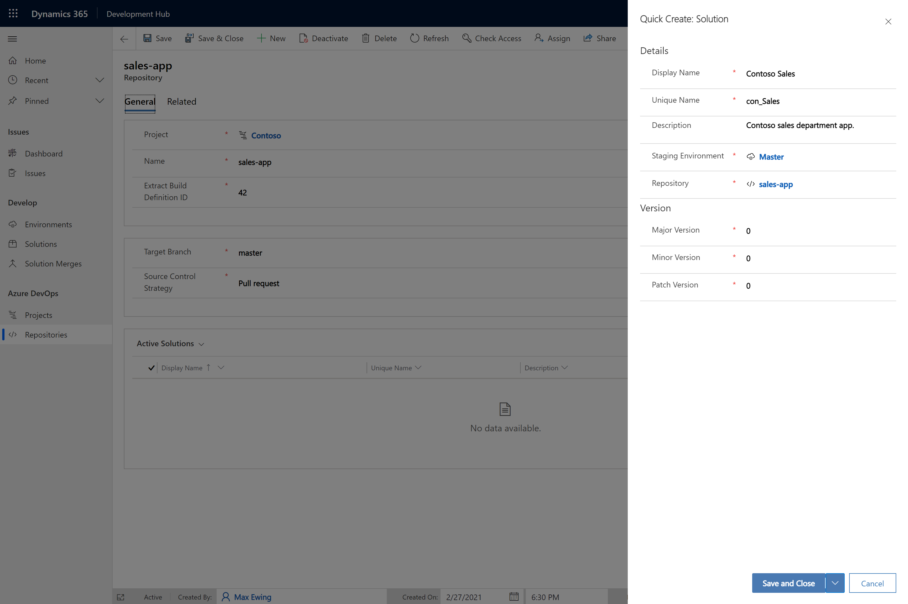

# Development Hub 

A model-driven app that provides an enhanced development workflow for teams building Power Apps in a shared development environment. Enables continuous integration by automatically creating pull requests or commits for individual developer's changes.

For more context, read [this](https://medium.com/capgemini-microsoft-team/continuous-integration-for-power-apps-the-development-hub-7f1b4320ecfd?source=friends_link&sk=c5034f278e70bfd9aa2dce502dd490d9) introductory blog post.

## Table of contents

* [Prerequisites](#prerequisites)
* [Installation](#installation)
  + [Create flow connections](#create-flow-connections)
  + [Deploy the package](#deploy-the-package)
* [Configuration](#configuration)
  + [Register an Azure DevOps project](#register-an-azure-devops-project)
  + [Register a Git repository](#register-a-git-repository)
  + [Register a master environment](#register-a-master-environment)
  + [Register a solution](#register-a-solution)
* [Usage](#usage)
  + [Create an issue](#create-an-issue)
  + [Develop a solution](#develop-a-solution)
  + [Merge a solution](#merge-a-solution)
    + [Merge source code](#merge-source-code)
    + [Perform manual merge activities](#perform-manual-merge-activities)
    + [Handle a failed merge](#handle-a-failed-merge)
* [Contributing](#contributing)

## Prerequisites

- At least two Dataverse environments
- An Azure DevOps organisation

One Dataverse environment acts as the development environment. The other environment(s) are referred to as 'master' environments. For more information on the purpose of a master environment, refer to the [Solution Lifecycle Management](https://www.microsoft.com/en-us/download/details.aspx?id=57777) document published by Microsoft. The relevant information can be found in the _environment topologies for development approaches_ table.

## Installation

### Create flow connections

You will need to create two flow connections in your development environment. Within the [Maker Portal](https://make.powerapps.com), go to your environment and navigate to _Data -> Connections_. Create a new _Approvals_ connection and a new _Azure DevOps_ connection. Ensure the Azure DevOps connection is signed in as a user with access to the Azure DevOps project(s) used for source control. 

Open the connections and note the connection names by taking them from the URLs, which will be in the format 'environments/environmentid/connections/apiname/_connectionname_/details'.

### Deploy the package

Download the package files from the Releases tab and follow Microsoft's guide to using the Package Deployer [here](https://docs.microsoft.com/en-us/power-platform/admin/deploy-packages-using-package-deployer-windows-powershell). 

You must provide several runtime settings. Refer to the helper PowerShell script below:

```powershell
$settings = [PSCustomObject]@{
  'ConnRef:devhub_sharedapprovals_6d3fc' = '<the connection name of the Approvals connection>'
  'ConnRef:devhub_sharedvisualstudioteamservices_d7fcb' = '<the connection name of the Azure DevOps connection>'
  'AzureDevOpsOrganisation' = '<the name of the Azure DevOps organisation>'
  'SolutionPublisherPrefix' = '<the prefix of the publisher (without leading underscore)>'
}
$settingsArray = $settings.PSObject.Properties | ForEach-Object { "$($_.Name)=$($_.Value)" }
$runtimePackageSettings = [string]::Join("|", $settingsArray)

Import-CrmPackage -PackageInformation $packages[0] -CrmConnection $conn -RuntimePackageSettings $runtimePackageSettings
```

## Configuration

### Register an Azure DevOps project

Register an Azure DevOps project by creating a new **Project** record.


 The name is the name of your Azure DevOps project. The name can't be updated after the record is created and must match the project name on Azure DevOps.

### Register a Git repository

Register a Git repository within a project by creating a new **Repository** record.


The name must match the repository name on Azure DevOps and it must exist in the chosen project. The target branch is the branch you would like to either push to or create pull requests into (determined by the source control strategy). 

To get the extract build definition ID, copy the _scripts_ folder and _azure-pipelines-extract.yml_ file into your repository and create a pipeline for the YAML file. The ID of the resulting build definition  can then be used to populate this field.

> The sample build script assumes that your repository structure includes a _src_ folder at the root containing a _solutions_ folder - which then contains folders that match your solutions' unique names.  

You also need to ensure that permissions are configured correctly for this repository on Azure DevOps. Navigate to _Project Settings -> Repositories_ in your Azure DevOps project. Select the relevant repository and assign the following privileges to the project Build Service user:

* Contribute
* Contribute to pull requests
* Create branch 

### Register a master environment

Register a master environment by creating a new **Environment** record.


Enter a URL and name (this can be anything) for the environment as well as details about the app registration used to authenticate. Application users with the System Administrator role must be created in the development and master environments for the app registration. Follow Microsoft's guide [here](https://docs.microsoft.com/en-us/powerapps/developer/common-data-service/use-single-tenant-server-server-authentication#azure-application-registration).

### Register a solution

Register a solution within a repository by creating a new **Solution** record.



Manually create (or import) your unmanaged solutions in the master environment. Update the version numbers to match the solution in the master environment if you are migrating to the Development Hub with an existing solution.

## Usage

### Create an issue

**Issue** records must be created to begin working on a new feature or bug fix.


These records are instead used to group related development and aid in applying semantic versioning to solutions. The Development Hub does not replace a conventional issue tracker (e.g Azure Boards). 

> Set the _Work Item ID_ field (in the _Azure DevOps_ tab) and the commit or pull request will be linked to the work item. 

### Develop a solution

An issue with a _To Do_ status will have a _Develop_ button in the ribbon. Clicking this will create a development solution and transition the issue to _In Progress_. The _Development_ tab will show details about the development solutions and solution merge history.


The developer must add any new components or components to be modified into their development solution. Development solutions should contain just the components created or updated for that issue and no more. Adding all assets to a development solution will add all assets to the target solution when merged.

> Only one developer should make changes to a component at a time. If a component appears in more than one development solution, it could result in either incomplete work being merged or solution merges failing due to missing dependencies. A warning will shown when approving a solution merge if there are potential conflicts with other development solutions.

### Merge a solution

A **Solution Merge** record should be created when development is complete on an issue. This will transition the issue status reason to _Developed_.


The solution merge is created in an _Awaiting Review_ status. Comments can be as notes and the solution merge either approved or rejected. 

An approved development solution will be merged into the target solution. If multiple solution merges have been approved, they will be queued. This means that an _Approved_ solution merge will transition to either a _Merging_ or _Queued_ status. A _Merged_ status will be reached when the solution merge has been committed to the target branch with a matching `Solution-merge-id` Git trailer in the commit message (this is automatically added). 

When using the _Pull request_ source control strategy, a pull request will be created automatically and the solution merge will transition to a status of _Awaiting PR Merge_.

> A _Feature_ issue will increment the minor version and a _Bug_ issue will increment the patch version. Major version increments must be done manually. 

#### Merge source code

If the solution to be merged has associated source code (e.g. you have made changes to plugin assemblies, web resources, tests or deployment logic) then you must provide the branch to be merged in the _Source Branch_ field.

> If your repository uses a _Push_ source control strategy, ensure that you perform any manual Git merging required on your source branch before creating the solution merge or you may get merge conflicts that prevent the solution merge being committed. It is recommended to use a _Pull request_ strategy for this reason.

#### Perform manual merge activities

Enabling the _Manual Merge Activities_ field on the solution merge record will cause the merging process to pause before extracting and committing to source control. This is useful where you are merging changes by hand (e.g. where you need to delete components from the solution).

When the merging process is in a state where manual merge activities can begin, the solution merge will transition to an _Awaiting Manual Merge Activities_ status. To notify the flow that the manual merge activities are complete, navigate to _Action items -> Approvals_ within Power Automate and set the approval status to merged.

#### Handle a failed merge

If the merging process failed (e.g. due to missing dependencies) then the solution merge will transition to a _Failed_ status. A note will be attached with a link to the failed flow run which can be used to diagnose the failure reason. A _Retry_ button is available to retry the merge after the necessary steps have been taken.

In the example below, a dependency was missing from the target environment:


## Resources

- [Blog post](https://medium.com/capgemini-microsoft-team/continuous-integration-for-power-apps-the-development-hub-7f1b4320ecfd)
- [Introduction video](https://youtu.be/p-z1iTxtaag)
- [Usage video](https://www.youtube.com/watch?v=co1zCvureiM)

## Contributing

Refer to the contributing [guide](./CONTRIBUTING.md).
