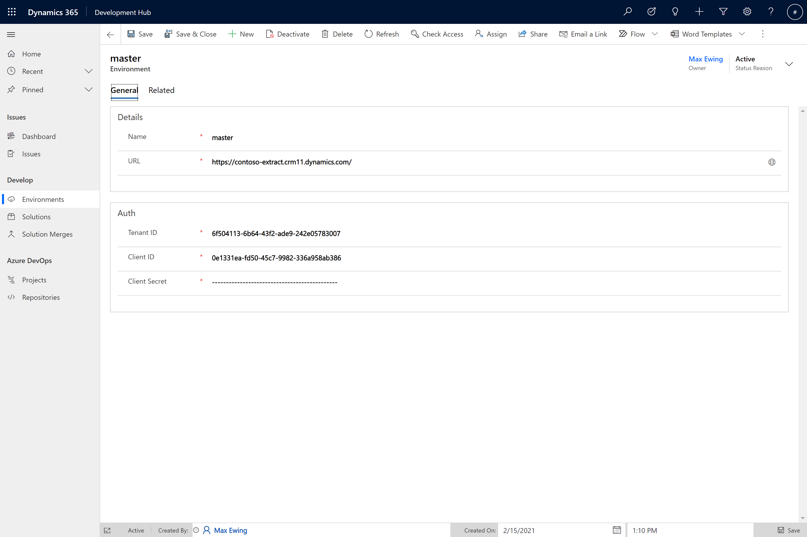
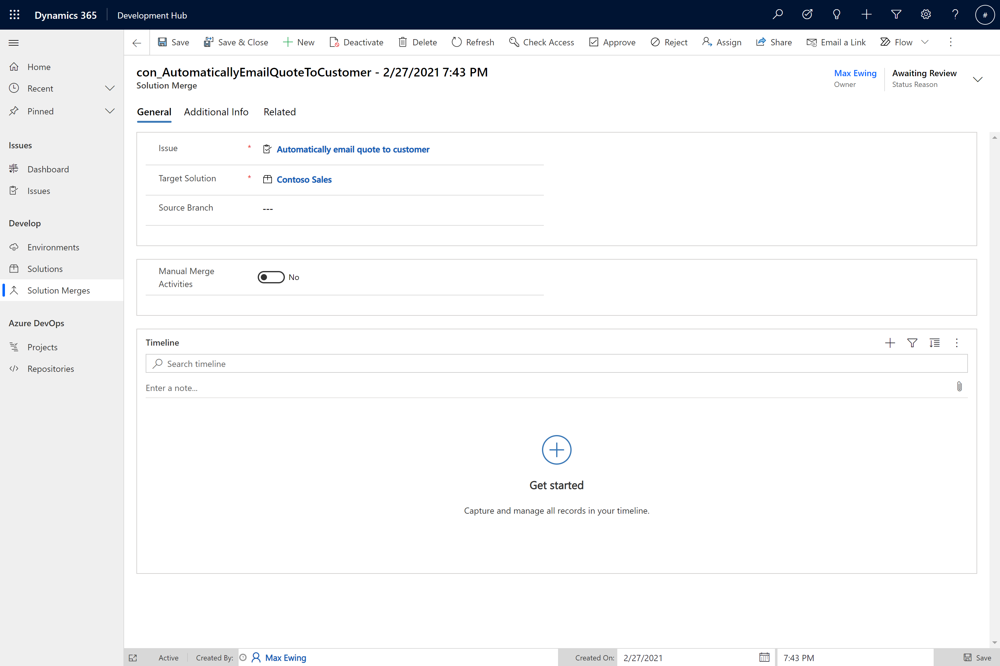

# Development Hub for Power Apps 

The Development Hub brings continuous integration to Power Apps development by allowing developers to easily submit their Power Apps configuration/customisation for review and automated merging to source control.

## Table of contents

* [Features](#features)
* [Video Demos](#video-demos)
* [Prerequisites](#prerequisites)
* [Installation](#installation)
  * [Deploy the package](#deploy-the-package)
  * [Register an app](#register-an-app)
  * [Configure plug-in steps](#configure-plug-in-steps)
  * [Configure Azure DevOps](#configure-azure-devops)
  * [Set solution environment variables](#set-solution-environment-variables)
  * [Set flow connections](#set-flow-connections)
* [Configuration](#configuration)
* [Usage](#usage)
  * [Create an issue](#create-an-issue)
  * [Develop a solution](#develop-a-solution)
  * [Merge a solution](#merge-a-solution)
  * [Merge source code](#merge-source-code)
  * [Perform manual merge activities](#perform-manual-merge-activities)
  * [Handle a failed merge](#handle-a-failed-merge)
* [Contributing](#contributing)
  * [Build a development environment](#build-a-development-environment)
  * [Set environment variables](#set-environment-variables)
  * [Run build tasks](#run-build-tasks)

## Features

- Peer review for configuration
- Merging for individual bugs and features
- Automated semantic versioning
- Automated source control

## Video Demos

[](https://www.youtube.com/watch?v=5jQkCPtvr-E)
[](https://www.youtube.com/watch?v=co1zCvureiM)

## Prerequisites

Two instances are required to use the Development Hub - a development instance and a 'master' instance.

For more information on the purpose of the master instance, refer to the [Solution Lifecycle Management](https://www.microsoft.com/en-us/download/details.aspx?id=57777) document published by Microsoft. The relevant information can be found in the _Instance topologies for development approaches_ table.

## Installation

### Deploy the package

The package can be deployed to your development environment using the Package Deployer. Download the package files from the Releases tab and follow Microsoft's guide to using the Package Deployer [here](https://docs.microsoft.com/en-us/power-platform/admin/deploy-packages-using-package-deployer-windows-powershell).

### Register an app

Access to the Common Data Service Web API is required in order to merge development solutions with the solution(s) in the master instance. Follow Microsoft's guide on registering an app with access to the Common Data Service Web API [here](https://docs.microsoft.com/en-us/powerapps/developer/common-data-service/use-single-tenant-server-server-authentication#azure-application-registration). You will need to use the client ID, tenant ID, and a client secret for the app you register in later steps.

### Configure plug-in steps

Use the plug-in registration tool to set the secure configuration parameters necessary for authentication for the Web API. The steps to set the secure configuration for are under the InjectSecureConfig plug-in within the DevelopmentHub.Develop assembly.

The secure configuration is a JSON object with the client ID, tenant ID, and client secret:

```json
{
  "ClientId": "<from app registration>",
  "TenantId": "<from app registration>",
  "ClientSecret": "<from app registration>",
}
```

**Note: the application user must should have admin permissions in both the master instance and the development instance.**

### Configure Azure DevOps

The Development Hub currently relies on integration with Azure DevOps to provide automated source-control functionality. 

Navigate to _Project Settings -> Repositories_ in the Azure DevOps project that contains repository. Select the relevant repository and assign the following privilges to the project Build Service user:

- Bypass policies when pushing
- Contribute
- Create branch 

A build definition capable of extracting solutions is required. There are several files in the [samples](./samples) folder to help you with this. If you use the sample files as is, copy the _scripts_ folder and _azure-pipelines-extract.yml_ file into your repository. The sample build script assumes that your repository structure is that you have a _src_ folder at the root, a _solutions_ folder within, and then folders that match your solutions' unique names. In addition, it expects a _solution.json_ within each of these solution folders that provides the development environment URL (see the _solution.json_ in the samples folder), and an _extract_ folder alongside it to contain the unpacked solution zip file fragments. You will also need to create a _Development Hub_ variable group that contains three variables - `Client ID`, `Tenant ID`, and `Client Secret`. These should be taken from the app registration created earlier.

If you have an existing folder structure which is different, the _Merge-SolutionVersion.ps1_ script will require tweaking - but the _azure-pipelines-extract.yml_ file shouldn't need to be changed.

### Set solution environment variables

There are four environment variables to set:

- Solution Publisher Prefix
- Azure DevOps Organization
- Azure DevOps Project
- Azure DevOps Extract Build Definition ID

The build definition ID is the numeric ID given to the build definition by Azure DevOps. This is the extract build created either by modifying the sample in this repository or by the Yeoman generator.

For more information on environment see this [link](https://docs.microsoft.com/en-us/powerapps/maker/common-data-service/environmentvariables).

### Set flow connections

There are four flows located in the _devhub_DevelopmentHub_Develop_ and _devhub_DevelopmentHub_AzureDevOps_ solutions that must be set. The flows to set the connections on are:

- When a solution merge is approved -> Merge the solution
- When a solution merge is merged -> Approve the first queued solution merge
- Environment Variable Key -> Environment Variable Value
- When a solution is merged -> Commit changes to source control

## Configuration

Ensure you have created or imported your unmanaged solution(s) for extraction in the master instance. Once this is done, they can be registered within the Development Hub app. 

The first step is to create an environment record for the master instance:



Then create a solution record for each solution in the master instance:


Do not change the version numbers if the solution is new. If it is an existing solution, update the version numbers to match the solution in the master instance. The version will from then on be managed by the Development Hub when merging changes.

## Usage

### Create an issue

Issues must be created within the Development Hub in order for a developer to begin working on a new feature or bug fix. 

The issue records in the Development Hub are used to group solution merge records and aid in applying semantic versioning to solutions. The Development Hub is not intended to replace a more conventional issue tracking system (e.g Azure Boards). It is suggested to either create issue records on-the-fly, at the beginning of a sprint, or by integrating Azure DevOps through a tool such as Power Automate. 

If your issues are on Azure Boards, you can set the `Work Item ID` field on the corresponding Development Hub issue. The commit will then be linked with the Azure DevOps work item. 


An issue with a 'To Do' status will have a *Develop* button in the ribbon. Clicking this will create a development solution and transition the issue to 'In Progress'. The *Development* tab will show details about the development solutions and solution merge history.


### Develop a solution

The developer must add any new components or components to be modified into their development solution. It is important that only one developer makes changes to a component at a time. If a component appears in more than one development solution, it will result in either incomplete work being merged or solution merges failing due to missing dependencies. 

Development solutions should contain just the components created or updated for that issue and no more. Adding all assets to a development solution will add all assets to the target solution when merged.

### Merge a solution

Once the issue has been developed, a solution merge record can be created. This will transition the issue to 'Developed'. The solution merge is created in an 'Awaiting Review' status. Review comments can be added to the solution merge in the form of notes and the solution merge either approved or rejected. 

Once approved, the development solution will be merged into the target solution. If multiple solution merges have been approved, they will enter a queue. This means that an 'Approved' solution merge will transition to either a 'Merging' or 'Queued' status.

A successful solution merge will transition to an inactive 'Merged' status. The 'Version History' tab on the target solution record will also contain a new record with the post-merge unmanaged and managed solution zips available. The new solution version is based on the type of issue merged. A feature issue will increment the minor version and a bug issue will increment the patch version. Major version changes must be done manually. 




### Merge source code

If the solution to be merged has associated source code (e.g. you have made changes to plugin assemblies or web resources) then you must specify the source branch. Ensure that you perform any manual merging required in Git on your source branch before creating the solution merge. This branch will be merged automatically.

### Perform manual merge activities

Specifying that there are manual merge activities on the solution merge record will cause the merging process to pause before extracting to source control. This is useful where you are merging changes by hand e.g. components that need to be updated frequently by multiple developers or where you need to delete components from the solution. 

When the merging process is in a state where manual merge activities can begin, the solution merge will transition to an 'Awaiting Manual Merge Activities' status. If you are deleting components from the solution in the master instance, it is recommended to update the major version of the solution record in the Development Hub during this period.

To notify the flow that the manual merge activities are complete, navigate to _Action items -> Approvals_ within Power Automate and set the approval status to merged.

### Handle a failed merge

If the merging process failed (e.g. due to missing dependencies) then the solution merge will transition to a 'Failed' status. A *Retry* button is available after the necessary steps have been taken. Failure reason will be attached as a note to the solution merge record.

## Contributing

### Build a development environment

A VS Code/Cake task has been defined which will allow you to recreate a development instance for a given solution. If you wanted to contribute to the devhub_DevelopmentHub_Develop solution, you would open the command palette within VS Code (_ctrl + shift + p_) and select _Tasks: Run Task_ followed by _Build Development Environment_ and _devhub_DevelopmentHub_Develop_. This task requires that you have first configured the development environment url _solution.json_ file in the corresponding solution folder and set up your environment variables (see below).

If you do not have an existing instance, you can create one for free with the [Power Apps Community Plan](https://docs.microsoft.com/en-us/powerapps/maker/dev-community-plan) or by signing up for a [trial](https://trials.dynamics.com/).

### Set environment variables

Two environment variables are required to enable you to authenticate with the development and staging environments:

- CAKE_DYNAMICS_USERNAME_DEVELOPMENT_HUB
- CAKE_DYNAMICS_PASSWORD_DEVELOPMENT_HUB

The username in the environment variable is used unless overridden by the username set in the corresponding _solution.json_ file. This is useful where the username for each solution is different (e.g. where you have multiple trials).

### Run build tasks

A number of Cake build tasks have been defined to make development easier. It is recommended to call these via the command palette (_ctrl + shift + p_) and selecting _Tasks: Run Task_.

The following tasks are available: 

- Build Development Environment
- Extract Solution
- Pack Solution
- Build Package
- Deploy Plugins
- Deploy Workflow Activities
- Generate Model

### Extract to source control

Before creating a pull request containing your changes, you must extract the solutions into source control. This can be done using the _Extract Solution_ task and specifying which solution(s) to extract.
